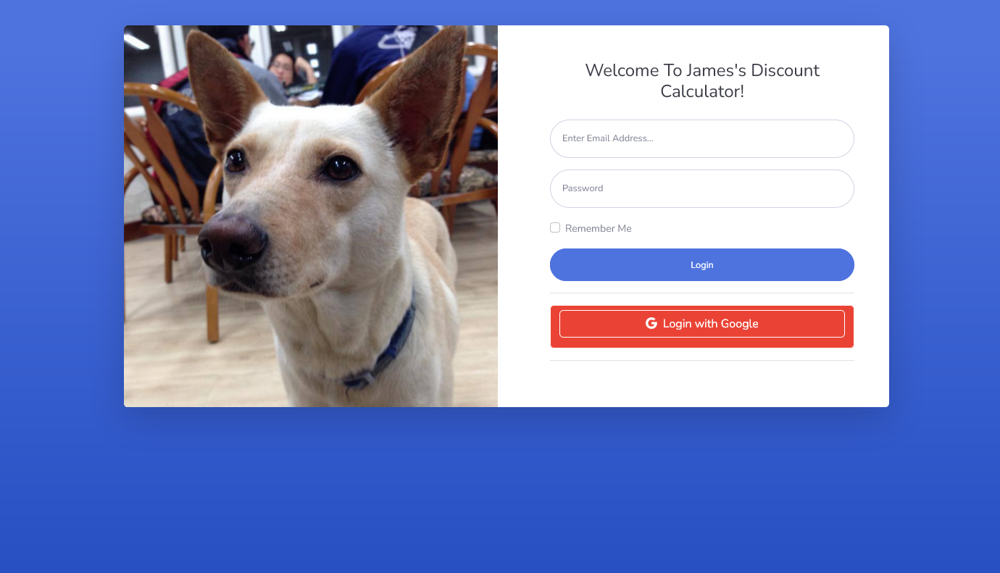
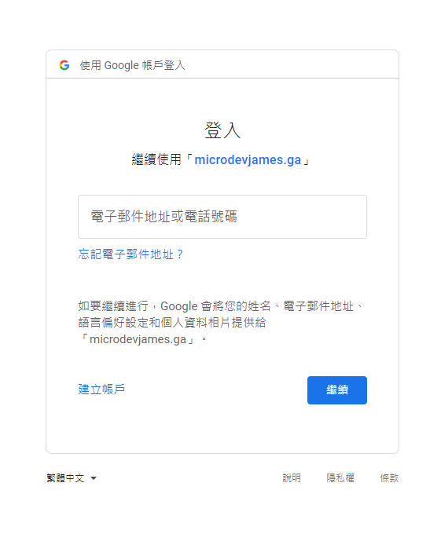
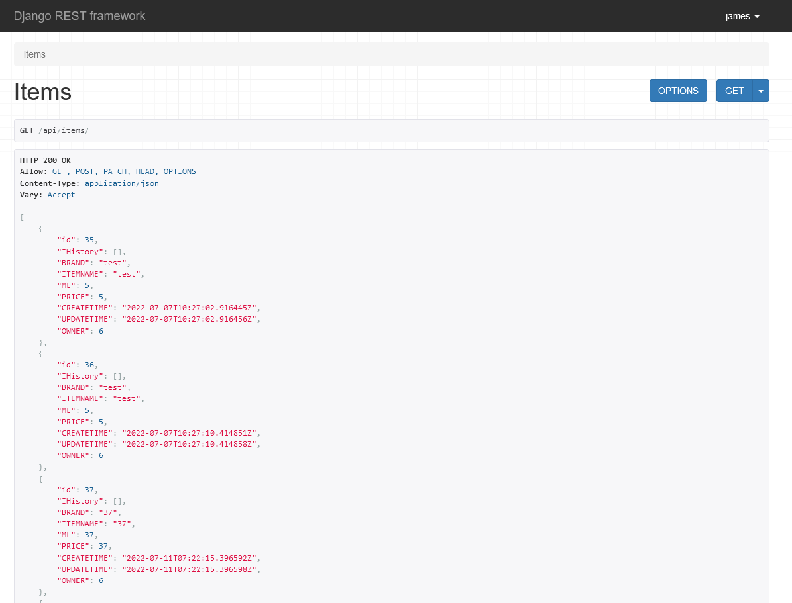
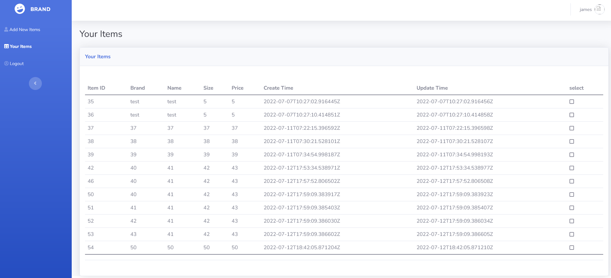
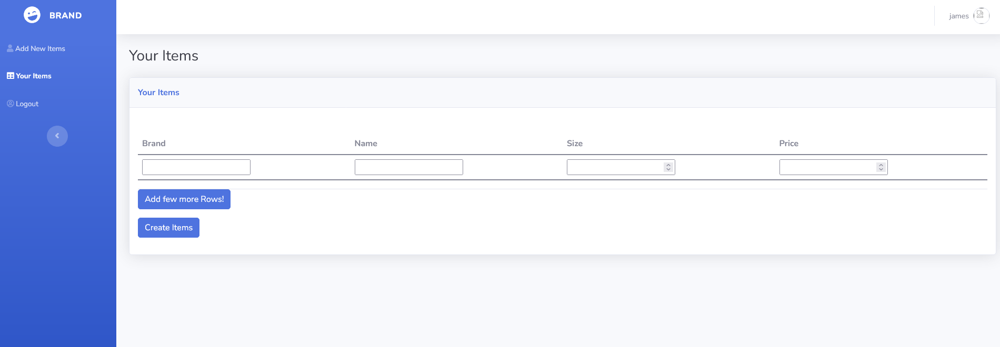

# 歡迎來到折扣計算機專案

## 關於本專案

本專案的完整名稱為從零開始之我要找工作，顧名思義這個專案屬於一個技能摸索、技能實踐以及找工作用的專案。

這裡是我的網頁 [microdevjames.ga] 目前尚屬於測試狀態，會不定期下線與測試以及更新，當然也有修 bug 的部份。

歡迎登入本網站點點看，登入部分請直接用 Google 登入即可自動創建帳號。

## Keyword

Nginx, Cloudflare DNS, Python, Django, Restful API, Bootstrap, Javascript, Axios, Google API, ORM, API unit test

## Briefing

本專案以Python Django為基底，主要由六個頁面組成：

1. Login 頁面，該頁面提供使用者進行登入，目前僅提供以 Google OAuth 2.0 的方式進行登入。（已完成）
   
   
2. API 頁面，該「頁面」為圖形化的 API 畫面，使用 Django Rest Framework 搭建，提供使用者 Get 、 Post 與 Patch api/items/ (Patch正在調整中)。（已完成）（Login required）
   
3. Items 頁面，該頁面為展示該登入使用者自己建立過的商品記錄。該頁面中的內容呼叫 GET api/items/ 以完成串接。（已完成）
   
4. 建立新商品與更新商品頁面，該頁面使用 javascript 將 HTML 內的輸入包裝成 JSON 並且通過 axios 進行對後端 Post 的串接，有使用 csrf 防禦。（Post 已完成 Patch 正在開發中)
   
5. 計算機頁面，根據於 Items 頁面當中被選取的商品進行折扣計算，預計於前端進行計算。（尚未完成）
6. 歷史價格查詢，根據 Items 頁面當中被選取的商品進行歷史價格展示。（尚未完成）

簡言之，目前後端的部份已經大體完成，剩下前端畫面的部份需要進行實現。

[microdevjames.ga]:http://microdevjames.ga